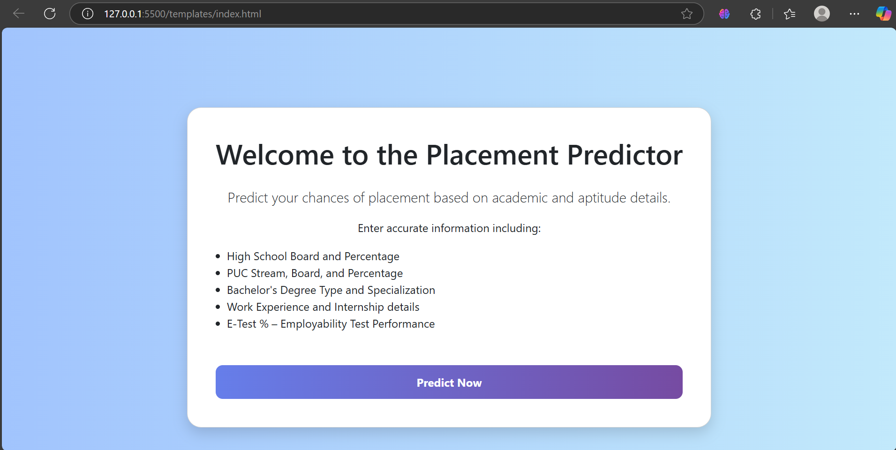
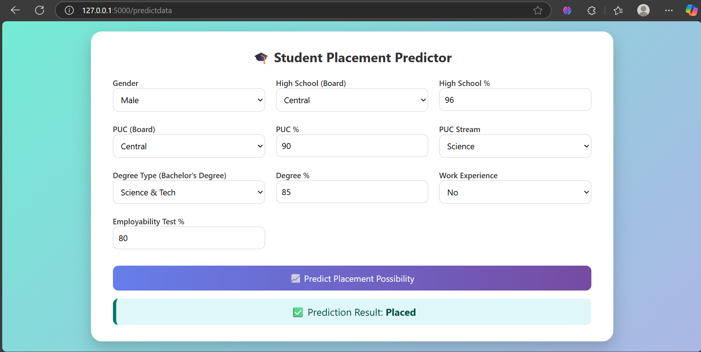

# Placement Prediction using Machine Learning
## 📷 Screenshots

### Home Page


### Prediction Page


This project aims to predict whether a student will be placed or not based on various academic and demographic features using machine learning classification algorithms.

---

## 🔗 Repository

[GitHub Repository](https://github.com/IbrahimBagwan1/ML-Project-Placement-Prediction.git)

---

## 📌 Table of Contents

- [Project Overview](#project-overview)
- [Tech Stack](#tech-stack)
- [Project Architecture](#project-architecture)
- [Installation](#installation)
- [Usage](#usage)
- [Folder Structure](#folder-structure)
- [Model Training](#model-training)
- [Testing](#testing)
- [Results](#results)
- [License](#license)
- [Contact](#contact)

---

## 🎯 Project Overview

The goal of this machine learning project is to build a classification model that predicts student placement outcomes using historical data. It evaluates multiple models like Logistic Regression, Decision Trees, Random Forest, XGBoost, CatBoost, and others to identify the best performer.

---

## 🧰 Tech Stack

- Python 3.8+
- Scikit-learn
- Pandas, NumPy
- XGBoost, CatBoost
- Matplotlib, Seaborn (for visualization)
- MySQL (for data storage and retrieval)
- Logging
- Custom Exception Handling
- Modular Pipeline Architecture

---

## 🏗️ Project Architecture

```
ML-Project-Placement-Prediction/
│
├── artifacts/         # Trained model and transformers
├── data/              # Raw dataset (if not fetched from DB)
├── notebooks/         # Jupyter notebooks for EDA
├── src/
│   └── MlProject/
│       ├── components/ # Data ingestion, transformation, model trainer
│       ├── pipeline/   # Training and prediction pipeline
│       ├── utils.py    # Utility functions
│       ├── logger.py   # Logging configuration
│       └── exception.py # Custom exception handling
├── app.py             # Main training script
├── requirements.txt   # Python dependencies
├── README.md          # Project documentation
└── setup.py           # Project setup
```

---

## 🛠️ Installation

1. Clone the repository:
  ```bash
  git clone https://github.com/IbrahimBagwan1/ML-Project-Placement-Prediction.git
  cd ML-Project-Placement-Prediction
  ```

2. Create a virtual environment and activate it:
  ```bash
  python -m venv venv
  source venv/bin/activate      # For Linux/Mac
  venv\Scripts\activate         # For Windows
  ```

3. Install the required dependencies:
  ```bash
  pip install -r requirements.txt
  ```

4. Configure your MySQL database credentials in the data ingestion component.

---

## 🚀 Usage

To run the project end-to-end:
```bash
python app.py
```

To use the trained model for prediction, run the prediction pipeline or deploy using a Flask/Django interface (optional for future scope).

---

## 📂 Folder Structure

The project follows a modular structure for better scalability and maintainability. Refer to the [Project Architecture](#project-architecture) section for details.

---

## 📊 Model Training

The training pipeline includes:

- Reading data from MySQL
- Preprocessing categorical and numerical columns
- Training various ML models with hyperparameter tuning
- Selecting the best model based on accuracy
- Saving the best model to `artifacts/model.pkl`

Logging and error handling are integrated throughout the pipeline.

---

## ✅ Testing

You can test the saved model on custom inputs via a notebook or by implementing a simple Flask API for inference.

---

## 📈 Results

**Best performing model:**

- **Model:** Gradient Boosting Classifier  
- **Accuracy:** ~83.72%

Training logs are available via the built-in logging module.

---

## 📄 License

This project is licensed under the MIT License - see the [LICENSE](LICENSE) file for details.

---

## 📬 Contact

Created by **Ibrahim Bagwan**  
For queries or contributions, feel free to raise an issue or submit a pull request.

---

⭐ If you found this useful, give the repo a star!
